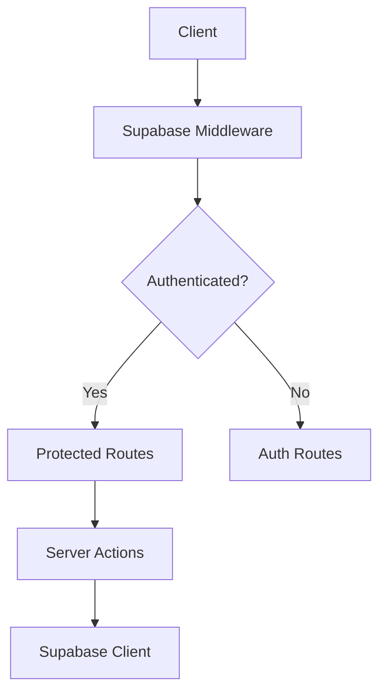

# Application Architecture

## Overview

This application uses a modern Next.js 14 architecture with Supabase for backend services, implementing type-safe server actions and middleware for secure data flow.

## Data Flow Architecture

### 1. Authentication Flow



### 2. Server Actions Layer

We implement a type-safe server actions pattern using:

- `action-client.ts` - Base action client with middleware support
- `withAuth` middleware - Ensures user authentication
- `withAdmin` middleware - Ensures admin privileges

Example usage:

```typescript
const myAction = createAction(
  async (context) => {
    // Your action logic here
    return new Response(JSON.stringify({ success: true }));
  },
  withAuth // Optional middleware
);
```

### 3. Middleware Stack

1. **Root Middleware** (`middleware.ts`)

   - Security headers
   - Cache control
   - Static asset handling

2. **Supabase Middleware** (`services/supabase/middleware.ts`)
   - Session management
   - Authentication redirects
   - Protected route access

## Best Practices

### 1. Authentication & Authorization

- Always use `withAuth` middleware for protected actions
- Implement role-based access control through `withAdmin` middleware
- Never expose sensitive data in client components
- Use server components for data fetching where possible

### 2. Data Fetching

```typescript
// ✅ Good - Server Component
async function UserProfile() {
  const profile = await getUserProfile(userId);
  return <div>{profile.name}</div>;
}

// ❌ Avoid - Client Component
function UserProfile() {
  const { data } = useQuery(['profile'], fetchProfile);
  return <div>{data.name}</div>;
}
```

### 3. Error Handling

- Use the `AppError` class for consistent error handling
- Implement proper error boundaries
- Log errors with appropriate context
- Return user-friendly error messages in production

### 4. Type Safety

- Use TypeScript strictly
- Define proper interfaces for all data structures
- Avoid using `any` type
- Utilize Zod for runtime type validation

### 5. Security

- Implement proper CORS headers
- Use environment variables for sensitive data
- Validate all user input
- Implement rate limiting where necessary

## Project Structure

```
├── app/                 # Next.js app router pages
├── components/         # Reusable React components
├── lib/               # Core utilities and helpers
│   ├── actions/      # Server actions
│   ├── errors/       # Error handling
│   └── logger/       # Logging utilities
├── services/         # External service integrations
│   └── supabase/    # Supabase client and queries
└── middleware.ts    # Global middleware
```

## Common Patterns

### 1. Server Action Pattern

```typescript
// 1. Define your action type
type CreatePostAction = {
  title: string;
  content: string;
};

// 2. Create the action
const createPost = createAction(async (context: ActionContext<CreatePostAction>) => {
  const { user, validatedData } = context;
  // Implementation
}, withAuth);
```

### 2. Error Handling Pattern

```typescript
try {
  // Your logic here
} catch (error) {
  Logger.getInstance().error(
    "Operation failed",
    { component: "componentName" },
    AppError.from(error)
  );
  throw error;
}
```

## Performance Considerations

1. Use server components by default
2. Implement proper caching strategies
3. Optimize images and assets
4. Minimize client-side JavaScript
5. Implement proper loading states

## Testing Strategy

1. Unit tests for utilities and helpers
2. Integration tests for server actions
3. E2E tests for critical user flows
4. Component testing with proper mocking

## Deployment

The application is configured for deployment on Vercel with Supabase integration:

- Automatic environment variable configuration
- Edge function support
- Serverless deployment
- Automatic preview deployments
